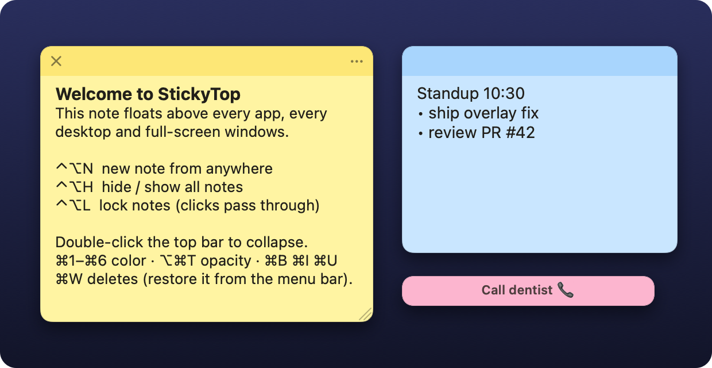
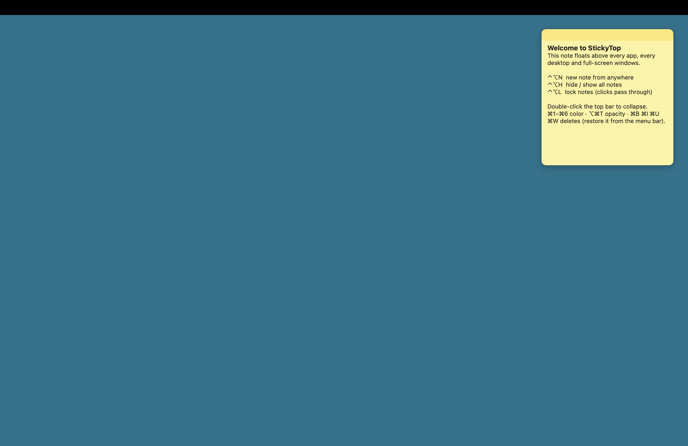

# StickyTop

Sticky notes for macOS that **never leave the screen — and never get in the way**. Like Stickies, but every note floats above every app, on every desktop (Space), and over full-screen windows. It never takes focus away from the app you're using.



## Why it stays on top

macOS gives this behavior only to a specific combination of settings, and StickyTop uses all of them:

| Setting | What it does |
|---|---|
| Agent app (`LSUIElement`, `.accessory`) | No Dock icon. Its windows are also allowed into *other apps'* full-screen Spaces. |
| `NSPanel` + `.nonactivatingPanel` | Clicking or typing in a note doesn't activate StickyTop, so the full-screen app keeps its Space and menu bar. |
| Window level `.statusBar` | Sits above normal app windows and above other apps' floating palettes. |
| `.canJoinAllSpaces` | The note is on every desktop at once. |
| `.fullScreenAuxiliary` | The note can appear over full-screen apps. |
| `.stationary` | Mission Control and Show Desktop leave the note alone. |
| `hidesOnDeactivate = false` | Panels hide on app switch by default. This turns that off. |

`make verify` checks this end to end: a probe app goes full screen in its own Space, then asks the window server which windows are on screen, from front to back.

```
Full-screen probe window: (1512.0, 949.0) on a (1512.0, 982.0) screen, stack index 4
  StickyTop note on screen: stack index 1, layer 25, frame (1190.0, 64.0, 290.0, 300.0)
PASS: 1 note(s) visible in front of a full-screen app in another Space
```



## Never in the way

The usual complaint about always-on-top windows is that they cover the text you're typing. StickyTop notes move out of the way on their own:

- **Dodge text cursor.** When you type in another app and the text cursor gets close to a note, the note slides clear of that line (it prefers moving up or down, because typing moves the cursor sideways). After the cursor has been gone for a second, the note slides back. If a note is too big to move anywhere, it fades to a ghost instead. The spot you chose for the note is never overwritten.
- **See through while dragging.** Drag a file, a window or a text selection across a note and the note turns see-through, so the drop lands on whatever is underneath. A drag that starts inside a note, such as selecting its text, keeps the note solid.
- **Hold ⌃⌥ to peek.** While you hold Control-Option, every note turns see-through and clicks pass through to the app underneath. Quick ⌃⌥ shortcuts don't trigger it; the keys have to be held for 0.3 s.

Dodging the text cursor needs **Accessibility** access. Turn it on under the menu bar icon → **Never in the Way → Dodge Text Cursor — Allow Access…**. StickyTop reads only the cursor's position (the selected range and its bounds), never the text you type. It checks 10 times a second on a background queue with a 150 ms timeout, so a frozen app can't stall your notes. Idle CPU use is about 0.1%. Seeing through while dragging and peeking need no permission.

It works wherever apps report their text cursor to Accessibility, which covers most native Mac apps. Chromium and Electron apps (Chrome, Slack, VS Code…) are asked to switch their accessibility support on; how well they report the cursor varies. **After every update, grant access again.** This build is ad-hoc signed, so macOS ties the grant to the exact binary. After an update, System Settings still shows StickyTop switched **on**, but the grant no longer applies, and toggling it doesn't help. Remove StickyTop with **−** in **System Settings → Privacy & Security → Accessibility** and add it again with **+**. A Developer ID-signed build would keep the grant across updates.

## Keep Fresh: notes you can't tune out

When a note never changes, people soon stop seeing it. This is called reminder blindness, and the usual fix is to move, recolor or reword the note from time to time. That's also a common strategy for ADHD. Turn on **Keep Fresh** from a note's ••• menu and StickyTop does it for you:

- **Spaced nudges.** The first comes after 15 minutes, then 30 minutes, 1 hour, 2 hours, and every 2 hours after that. If the Mac sleeps through several, you get one nudge on waking, not a burst.
- **Every nudge looks different.** The note gives a soft double flash with a glowing edge and shifts to a new shade of its color, so it never looks quite the same twice. A reminder card also slides up from the bottom edge with rotating wording and the note's age, for example *"Still on your list · 3 days"*. Click the card to dismiss it; otherwise it tucks itself away after a few seconds. A collapsed note shows the reminder in its drag bar instead.
- **Reworded by Apple Intelligence (optional, off by default).** Turn on **Nudges → Reword with Apple Intelligence** (needs macOS 26 with Apple Intelligence enabled). The on-device model prepares a new phrasing of the note's first line in the background before each nudge, so nudges never wait on it. For example, "Pick up Maya from soccer at 5" becomes "✦ Collect Maya from soccer at 5". Reworded reminders are marked **✦**, it runs offline, and your note itself is never changed. Every rewording must pass a safety check before it's shown: it must keep every name, number and date, invent no times, deadlines or people, not claim the task is done, and actually read differently. Otherwise the rotating templates are used. A small model can still drift slightly (in testing, "renew" became "apply for" once), which is why the ✦ marks it and your own words stay visible above the card.
- **Respectful.** StickyTop doesn't nudge while you're typing in the note, while notes are hidden or dodging your cursor, or while nudges are paused. Editing a note restarts its schedule, and picking a color resets its shade.

The menu bar → **Nudges** menu has **Nudge Fresh Notes Now**, **Pause Nudges for 1 Hour**, and the Apple Intelligence switch.

## Features

- Unlimited notes in 6 Stickies colors, with rich text (bold, italic, underline, strikethrough, sizes, links).
- Drag the top bar to move a note. Drag any edge or corner to resize it.
- Double-click the top bar to collapse a note to one line. The line shows the note's title.
- Opacity levels of 100%, 85%, 70% and 50%. A translucent note turns solid while the pointer is over it.
- **Never in the way**: notes dodge your text cursor, let drags pass through, and turn see-through while you hold ⌃⌥ (see above).
- **Keep Fresh**: spaced nudges with a new shade and a reminder card, so you keep noticing a note (see above).
- **Lock** (click-through): notes stay visible, but clicks pass through to the app underneath.
- **Global hotkeys** work from any app, with no Accessibility permission needed.
- **Recently Deleted**: the last 30 deleted notes can be restored from the menu bar. Blank notes are discarded.
- Paste cleanup: formatting survives a paste, but foreign colors and backgrounds are removed. White text copied from a dark-mode app won't disappear on paper.
- Auto-save, an atomic JSON store, a one-generation backup, and corrupt files are set aside, never deleted.
- Notes stranded on an unplugged monitor are pulled back on screen. **Gather Notes Here** collects them all.
- Launch at Login, so notes come back after a restart.
- Single instance: launching the app a second time just shows your notes.

## Shortcuts

| Anywhere | |
|---|---|
| ⌃⌥N | New note under the pointer |
| ⌃⌥H | Hide / show all notes |
| ⌃⌥L | Lock / unlock notes (click-through) |
| hold ⌃⌥ | Peek through every note |

| In a note | |
|---|---|
| ⌘N | New note (cascaded, same color) |
| ⌘W | Delete note (restore from menu bar) |
| ⌘M / double-click bar | Collapse / expand |
| ⌘1 … ⌘6 | Yellow, Blue, Green, Pink, Purple, Gray |
| ⌥⌘T | Cycle opacity |
| ⌘B ⌘I ⌘U ⇧⌘X | Bold, italic, underline, strikethrough |
| ⌘= / ⌘- | Bigger / smaller text |
| ⌥⇧⌘V | Paste as plain text |

Everything else is in the menu bar icon: the list of notes, Recently Deleted, Float Above Everything, Launch at Login, and Show Notes Folder.

## Install

Requires macOS 13 or later, and Xcode (or the Swift 6 toolchain) to build.

```bash
make install     # builds a universal StickyTop.app, copies it to /Applications, launches it
```

Other targets:

```bash
make test        # unit tests (model, persistence, geometry)
make app         # dist/StickyTop.app (ad-hoc signed)
make dmg         # dist/StickyTop-1.2.0.dmg (drag-to-Applications)
make verify      # full-screen overlay check (StickyTop must be running)
make verify-dodge  # real text-cursor dodge check (installed app needs Accessibility; hands off ~10 s)
```

In-app integration test (debug builds; uses a scratch folder, never your notes):

```bash
swift build && .build/debug/StickyTop --data-dir /tmp/stickytop-test --self-test
```

Live, narrated demo of Keep Fresh nudges (debug builds; throwaway notes, about 35 s):

```bash
swift build && .build/debug/StickyTop --demo-nudges
```

### Distributing to other Macs

The default build is ad-hoc signed, which is fine for your own Mac. For other Macs, sign with a Developer ID and notarize:

```bash
SIGN_IDENTITY="Developer ID Application: Your Name (TEAMID)" make dmg
xcrun notarytool submit dist/StickyTop-1.2.0.dmg --keychain-profile <profile> --wait
xcrun stapler staple dist/StickyTop-1.2.0.dmg
```

## Data

Notes live in `~/Library/Application Support/StickyTop/notes.json`. The previous session's copy is kept in `notes.backup.json`. Text is stored as a keyed-archived `NSAttributedString`, because RTF quietly turns the system font into Helvetica. Each note also has a `plainText` copy, so the file stays useful outside the app.

## Project layout

```
Sources/StickyCore/     Model, JSON store, frame + dodge geometry, nudge schedule (pure Swift, unit-tested)
Sources/StickyTop/      AppKit app
  NotePanel.swift         The always-on-top window configuration
  NoteWindowController    One note: view setup, model sync, shortcuts, menu
  NoteManager             All notes: create/delete/restore, save, screens, prefs
  DodgeCoordinator        "Never in the way": caret dodge, drag-through, peek
  CaretTracker            Accessibility-based text-cursor finder (background queue)
  NudgeCoordinator        "Keep Fresh": spaced nudges, pause, on-device rewording
  Rephraser               Apple Foundation Models rewording (macOS 26+, optional)
  StatusMenuController    Menu bar icon + menu
  HotKeys.swift           Carbon global hotkeys
  SelfTest.swift          In-process integration test (DEBUG only)
Tests/StickyCoreTests/  Swift Testing suites
scripts/                App bundling, icon renderer, DMG, full-screen probe
```

## Known limits

- Nothing can draw over the login window, the lock screen, or secure system prompts. Apps that take exclusive control of the display (some games, some slideshow modes) are the same.
- Launch at Login may ask for approval in **System Settings → General → Login Items** the first time.
